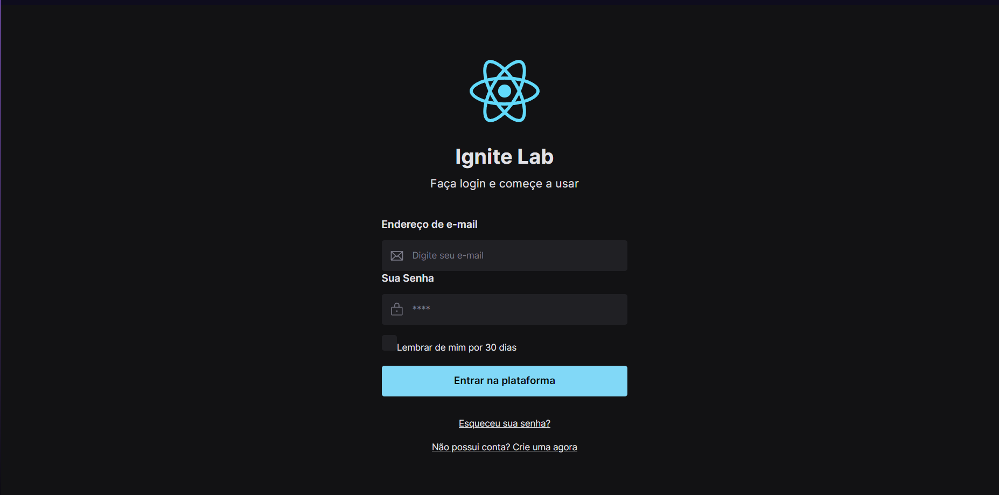

# Ignite lab - Figma ao react

Um projeto desenvolvido durante um evento da rocketseat onde desenhei a interface pelo figma e logo apos criei todos os componenes em react além de ter realizado deploy no storybook fazendo por fim um design system completo.


## Demonstração




## Rodando localmente

Clone o projeto

```bash
  git clone https://link-para-o-projeto
```

Entre no diretório do projeto

```bash
  cd my-project
```

Instale as dependências

```bash
  npm install
```

Inicie o servidor

```bash
  npm run dev
```


## Layout

O layout da aplicação está disponível no Figma:

<a href="https://www.figma.com/file/z8Hk5qGxqCUAv1kbtphLaD/igniteLab?type=design&mode=design&t=lgCzTy5Wn18TsbIf-0">
  
</a>
